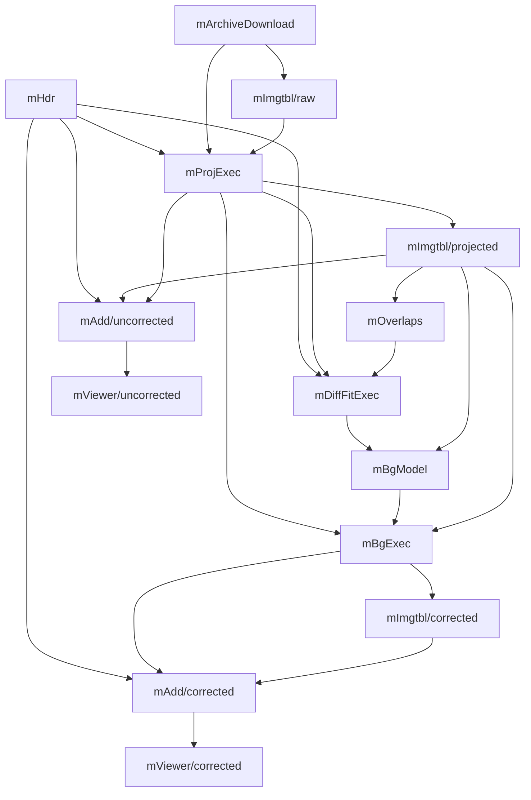
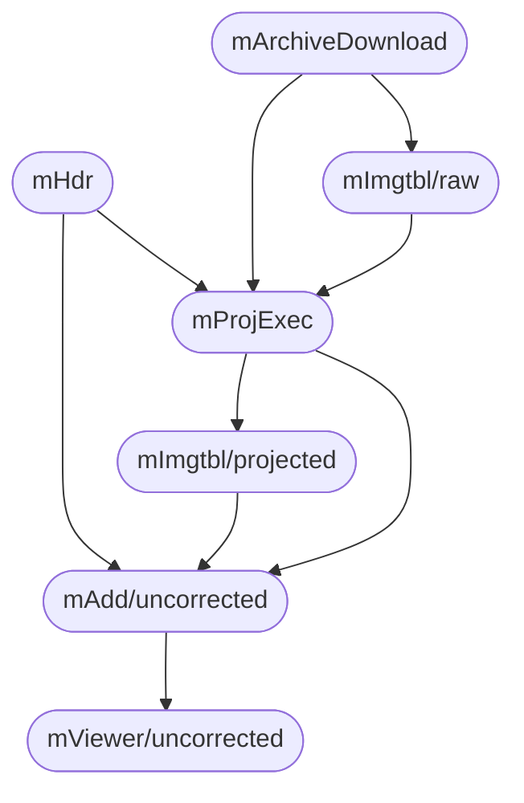

# research

マローンの論文を踏襲して，Scientific Workflows のターゲットパラメータの推定値を生成する

## フォルダ構成

### exec

Scientific Workflows を実行するファイル群

### analysis

Scientific Workflows の実行結果を取得する Cloud Watch の実行ファイル群

### db

sqlite の db ファイルを保存

### flow

新しく実装しているソースコード群
タスク実行->ターゲットパラメータのプロファイリングまでを行う

### venv

pip 管理のための仮想環境

#### venv フォルダの作成

```bash
$ python3 -m venv [newenvname]
```

#### Activate

```bash
$ source venv/bin/activate
```

#### Deactivate

```bash
venv$ deactivate
```

#### インストールしているライブラリを確認

```bash
venv$ pip list
```

## python のバージョン管理

pyenv を利用
→ 複雑そうだったので，pyenv を用いるのを諦めた（20220623）
→python のバージョン管理ができないのは困ることがありそうなので使うことにした（20220624）

### pyenv でインストールできる python のバージョンを確認

```bash
$ pyenv install --list
```

### python のインストール

```bash
$ pyenv install 3.9.9
```

### インストールした python のバージョンを確認

```bash
$ pyenv versions
```

### python のバージョンを指定

#### global で設定

```bash
$ pyenv global 3.9.9
```

#### local で設定

```bash
$ pyenv local 3.9.9
```

### python のバージョン確認

```bash
$ python3 --version
```

## トラブルシューティング

### 特定バージョンのライブラリがインストールできない

https://kajindowsxp.com/pip-unable/

### 「pyenv local」が効かない

https://utano.jp/entry/corrected019/02/pyenv-local-does-not-work/

### pyenv versions と python3 --version のバージョンが異なる

M1 版と Intel 版の Homebrew を併用するとき pyenv がうまく動かない問題を解決する
→https://qiita.com/tomtsutom0122/items/52487730001247fdc2c5
→ 複雑そうだったので，pyenv を利用するのを諦めた

## montage workflow(including background matching)



## montage workflow(don't including background matching)


